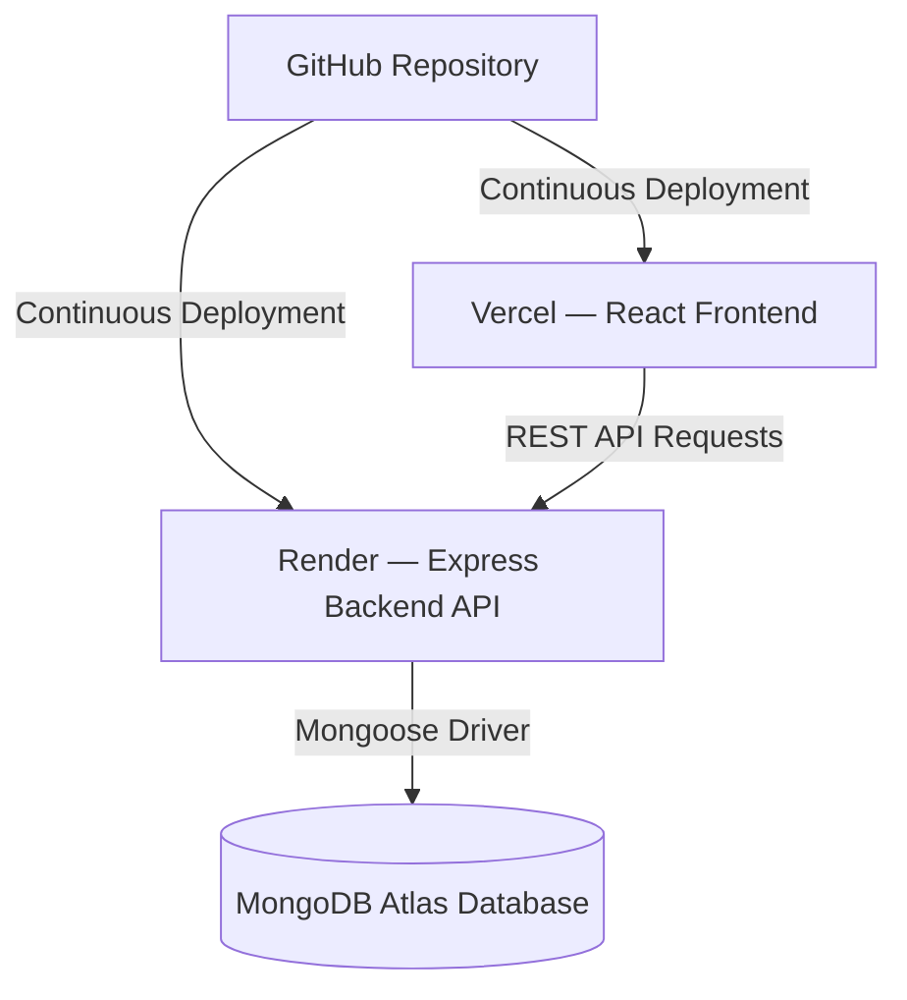

# Nexora — SaaS Website Builder


**Nexora** is a modern SaaS website builder platform designed to help users create, customize, edit, and publish high-converting business websites in minutes without writing code. 

Built with Apple-level spacing, Framer/Linear aesthetics, smooth glassmorphism, and modern micro-interactions, Nexora offers a 3-panel Visual Website Editor, 30 niche template presets, full-stack authentication, custom theme management, and instant cloud publishing.

---

## 🌐 Live Demo

- **Frontend Application (Vercel)**: [https://nexora-seven-umber.vercel.app](https://nexora-seven-umber.vercel.app)
- **Backend REST API (Render)**: [https://nexora-740u.onrender.com](https://nexora-740u.onrender.com)

---

## 🚀 Overview

Nexora provides a complete end-to-end full-stack website creation experience:

- **Browse Presets**: Select from 30 business industry template presets across E-Commerce, Gym & Fitness, Restaurants, Tech SaaS, Law Firms, Creative Agencies, Real Estate, and more.
- **Visual Website Editor**: Inspect and edit content live in a 3-panel workspace featuring Top Toolbar, Left Navigation Sidebar, Center Viewport Canvas, and Right Inspector Panel.
- **Full Page & Image Customization**: Edit logo text, brand logo images, hero titles, subtitles, feature lists, service pricing, team stories, contact emails, and 3 distinct business image slots.
- **Auto-Save & Version History**: Changes auto-save to MongoDB after 800ms of inactivity with complete Undo (`Ctrl+Z`) and Redo (`Ctrl+Y`) history support.
- **1-Click Publishing**: Instant public route generation (`/site/:slug`) hosted on Vercel with automatic view analytics tracking.
- **User Dashboard**: Manage created website projects, view live analytics, edit sites, or delete projects from a personal workspace.

---

## 🏗️ Architecture

The system architecture decouples the React SPA frontend, Node.js Express REST API, and MongoDB Atlas database:



---

## ✨ Features

- **User Authentication**: Full-stack registration, login, session persistence, and logout flow.
- **Interactive User Dashboard**: Workspace grid displaying all saved user websites, total view count, preset categories, and instant action buttons.
- **3-Panel Visual Editor**:
  - *Top Toolbar*: Auto-Save status badge, Undo/Redo history, Viewport switcher (Desktop, Tablet, Mobile), Zoom controls, Preview, and Publish.
  - *Left Sidebar*: Sections inspector, 3 Business Image asset uploader, 30 Preset switcher.
  - *Center Canvas*: Interactive live preview scaled to selected viewport size.
  - *Right Inspector*: Branding swatches, Font selector, Full Page Content editor, Button corner radius controls.
- **30 Niche Templates**: Pre-configured template presets covering top business verticals.
- **Theme & Preset Manager**: Admin Theme Manager allowing administrators to define custom brand color palettes, fonts, and category badges stored in MongoDB.
- **Instant Website Publishing**: Generates production-ready `/site/:slug` routes handled seamlessly by Vercel SPA rewrites.
- **Standalone Public Web Pages**: Production viewer rendering published sites with zero editor chrome and custom 404 page fallback.
- **Cloud Image Uploads**: Integrated file upload handler supporting Cloudinary API or base64 storage.
- **Responsive & Accessible UI**: Clean dark mode editor interface paired with white light mode canvas previews.

---

## 🛠️ Tech Stack

### Frontend
- **React.js** (v18) — Component-driven UI framework
- **Vite** — High-performance frontend build tool
- **Tailwind CSS** — Utility-first styling framework
- **Framer Motion** — Production-ready motion and gesture animations
- **Lucide React** — Modern icon suite
- **Canvas Confetti** — Celebration animations on publish

### Backend
- **Node.js** — JavaScript runtime environment
- **Express.js** — Fast, unopinionated web framework
- **MongoDB & Mongoose** — NoSQL database and Object Data Modeling (ODM)
- **CORS & Body-Parser** — Cross-Origin Resource Sharing and request payload parsing
- **RESTful API** — JSON endpoints for auth, websites, templates, themes, uploads, and AI generation

### Deployment & Infrastructure
- **Vercel** — Production frontend hosting with SPA rewrite configuration
- **Render** — Cloud web service hosting for Express backend
- **MongoDB Atlas** — Fully managed cloud MongoDB database
- **GitHub** — Source code version control and continuous integration

---

## 📁 Project Structure

```text
nexora/
├── client/
│   ├── src/
│   │   ├── api/
│   │   │   └── api.js              # Centralized production API client
│   │   ├── components/
│   │   │   ├── AdminThemeModal.jsx # Admin Theme Manager modal
│   │   │   ├── AuthModal.jsx       # Login & Signup modal
│   │   │   ├── Dashboard.jsx       # User website workspace
│   │   │   ├── Navbar.jsx          # Glassmorphic header
│   │   │   ├── PublicWebsite.jsx   # Standalone published site viewer
│   │   │   ├── SaaSPage.jsx        # Landing page with 6 sections
│   │   │   ├── TemplateCatalog.jsx # 30 templates gallery
│   │   │   ├── TemplateRenderer.jsx# Dynamic template canvas renderer
│   │   │   └── VisualEditor.jsx    # 3-Panel Visual Website Editor
│   │   ├── data/
│   │   │   └── templatesData.js    # 30 client template presets
│   │   ├── App.jsx                 # Top-level client router
│   │   ├── main.jsx                # React root entry point
│   │   └── index.css               # Global Tailwind CSS styles
│   ├── public/
│   ├── package.json
│   └── vercel.json                 # Vercel SPA route rewrite config
│
├── server/
│   ├── models/
│   │   ├── User.js                 # User schema
│   │   ├── Website.js              # Website project schema
│   │   ├── Theme.js                # Theme preset schema
│   │   └── TemplateModel.js        # Template seed schema
│   ├── routes/
│   │   └── api.js                  # Express API routes
│   ├── data/
│   │   └── templatesList.js        # 30 server template seeds
│   ├── server.js                   # Node.js Express server entry
│   └── package.json
│
├── .gitignore
├── vercel.json                     # Root Vercel config
└── README.md                       # Project documentation
```

---

## 💻 Installation & Local Setup

### Prerequisites
- **Node.js** (v18.x or higher)
- **npm** or **yarn**
- **MongoDB** (Local instance or MongoDB Atlas URI)

### 1. Clone Repository
```bash
git clone https://github.com/priyanshupokhariya5-crypto/nexora.git
cd nexora
```

### 2. Frontend Setup
```bash
cd client
npm install
npm run dev
```
The frontend dev server will start at `http://localhost:3000`.

### 3. Backend Setup
```bash
cd ../server
npm install
npm start
```
The Express backend server will start at `http://localhost:5000`.

---

## 🔑 Environment Variables

To configure environment variables for local development or production, create `.env` files (make sure `.env` is listed in `.gitignore`):

### Frontend (`client/.env`)
```env
# Local Development
VITE_API_URL=http://localhost:5000/api

# Production Deployment (Vercel)
# VITE_API_URL=https://nexora-740u.onrender.com/api
```

### Backend (`server/.env`)
```env
PORT=5000
MONGO_URI=mongodb://127.0.0.1:27017/nexora
# MONGO_URI=mongodb+srv://<username>:<password>@cluster.mongodb.net/nexora
CLIENT_URL=http://localhost:3000
```

---

## 📡 REST API Reference

The Express backend provides clean RESTful API endpoints:

| Method | Endpoint | Description |
| :--- | :--- | :--- |
| `POST` | `/api/auth/register` | Register a new user account |
| `POST` | `/api/auth/login` | Authenticate existing user |
| `GET` | `/api/templates` | Fetch catalog of 30 template presets |
| `GET` | `/api/templates/:id` | Fetch specific template details |
| `GET` | `/api/websites` | Fetch user websites (optional `?userId=`) |
| `POST` | `/api/websites` | Create or auto-save website configuration |
| `GET` | `/api/websites/:identifier` | Fetch website by ID or slug |
| `DELETE` | `/api/websites/:siteId` | Delete website project |
| `GET` | `/api/public/:slug` | Resolve public published site by slug |
| `GET` | `/api/admin/themes` | Fetch admin themes |
| `POST` | `/api/admin/themes` | Save custom admin theme |
| `DELETE` | `/api/admin/themes/:id` | Delete custom admin theme |
| `POST` | `/api/upload` | Upload image file (Cloudinary / Base64) |

---

## 🖼️ Screenshots

*Placeholders for application screenshots:*

- **Landing Page & 30 Templates Showcase**: `[Screenshot Placeholder: Landing Page]`
- **3-Panel Visual Website Editor**: `[Screenshot Placeholder: 3-Panel Visual Editor]`
- **User Dashboard**: `[Screenshot Placeholder: User Workspace]`
- **Published Public Website**: `[Screenshot Placeholder: Public Site]`

---

## 🔮 Future Improvements

- **AI Full Website Generation**: Auto-generate complete 5-page websites from a single prompt.
- **Custom Domain Mapping**: Allow users to connect custom DNS domains (e.g. `mybusiness.com`).
- **Stripe Subscription Tiers**: Starter, Pro, and Business billing integration.
- **Advanced Analytics**: Detailed visitor analytics, click heatmaps, and conversion tracking.
- **Drag-and-Drop Page Builder**: Fine-grained drag-and-drop block reordering.

---

## 👨‍💻 Author

**Priyanshu Pokhariya**  
B.Tech CSE — Internet of Things & Data Science  
Amrapali University  

- **GitHub**: [@priyanshupokhariya5-crypto](https://github.com/priyanshupokhariya5-crypto)

---

## 📜 License

This project is licensed under the MIT License — see the repository for details.

---

⭐ **If you like this project, consider giving it a star on GitHub!**
